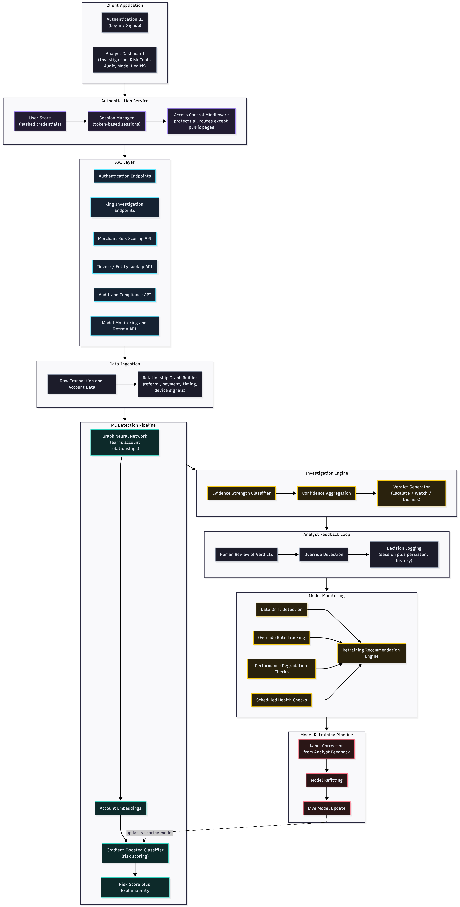

# Ring Sentinel

**Coordinated abuse intelligence for fraud teams — an autonomous investigation platform that detects fraud rings, not just risky transactions.**

Most fraud systems score one transaction at a time. That's exactly what coordinated abuse is built to slip past — a group of accounts working together, sharing a device, a payout destination, or a referral chain, where no single transaction looks suspicious on its own. Ring Sentinel detects the *ring*: a graph neural network learns relationship structure across five real signal types, a gradient-boosted classifier turns that into a per-account risk score, and an autonomous tiered agent decides — live, on demand — which connected accounts genuinely belong together and what to do about it.

Built strictly **defense-only**: Ring Sentinel flags coordinated abuse for a human analyst to Escalate, Watch, or Dismiss. It never blocks, freezes, or takes automated action against any account.

---

## Results

Evaluated on a held-out test set, using the current 5-relation detection model:

| Metric | Score |
|---|---|
| **Precision** | 99.1% |
| **Recall** | 91.3% |
| **Ring-level recall** | 99.3% |

**False-positive cost**

| | |
|---|---|
| False positives | 9 (out of 983 accounts escalated) |
| Total accounts monitored | 19,169 |
| Assumed cost per false-positive review* | ₹200 |
| **Total false-positive cost** | **₹1,800** |
| Exposure correctly identified | ₹128,418 |
| **Return on review cost** | **~71×** — every ₹1 spent clearing a false positive corresponds to ₹71 of real fraud exposure caught |

*Assumed analyst review cost per flagged case, used for planning purposes — not a measured operational figure, since this is a research benchmark, not a live deployment.*

At 99.1% precision, false positives are rare enough that their total review cost is a small fraction of the fraud exposure the system correctly surfaces — the 9 flagged-in-error cases here are also confirmed to include **zero** accounts from the dataset's legitimate look-alike clusters (families, coworkers, shared households), meaning the false positives that do occur aren't concentrated in the cases that would be most damaging to flag wrongly.

In production terms: **99 out of every 100 accounts flagged are genuinely part of a coordinated ring**, and the system catches **99.3% of actual fraud rings** in the dataset — with only a handful of false positives across the entire account base, none of them from accounts that only *look* related (family members, coworkers, shared households) but aren't actually committing fraud together.

**The detection signal set:**

| Signal | What it captures |
|---|---|
| Referral chain | Who invited whom onto the platform |
| Payout convergence | Multiple accounts cashing out to the same destination |
| Tight proximity | Accounts signing up within 60 minutes of each other |
| Loose proximity | Accounts signing up within a wider 5-day window |
| Device fingerprint | Accounts sharing the same device |

Every one of these is combined by the graph neural network into a single learned representation per account — the model isn't hard-coded to weight any one signal; it learns which combinations actually indicate coordinated abuse versus coincidence (e.g., a family legitimately sharing a device looks structurally similar to a fraud ring on paper, but the model has to learn to tell them apart, and the results above show it does).

---

## System Architecture



The platform is organized into five layers:

1. **Client Application** — an authenticated analyst dashboard (Investigation, Risk Tools, Audit, Model Health) sitting behind a login/signup flow.
2. **Authentication Service** — session-based access control; every ring decision is tied to the analyst who made it.
3. **API Layer** — a REST interface covering investigation, merchant-facing risk scoring, device/entity lookup, audit, and model operations.
4. **Detection Pipeline** — the graph neural network and classifier described above, feeding a live **Investigation Engine** that classifies evidence strength, aggregates confidence, and produces a verdict.
5. **Feedback & Monitoring Loop** — every analyst decision is logged and compared against the AI's own recommendation; data drift, override rate, and model performance are tracked continuously, feeding a retraining recommendation engine.

---

## What Makes This a Real System, Not a Mockup

- **Every number on screen comes from a live HTTP request.** The frontend has no embedded data — open the browser's network tab and watch it happen.
- **"Run Live Investigation" is a genuinely live computation**, not a replay of stored history. It queries real account/claims/payout data, pulls the trained model's actual risk score, and runs the same tiered promotion logic the offline benchmark was scored against — on demand, in the browser, while you watch each step arrive.
- **Escalate / Watch / Dismiss actions genuinely persist**, attributed to the analyst who made them, visible in a full audit trail.
- **The retrain button runs a real model refit** — analyst overrides become label corrections, and the live agent's risk scores update immediately. In testing, correcting a batch of overridden rings and retraining shifted verdicts across dozens of accounts within seconds.
- **Data drift is computed fresh on every check**, using four independent statistical methods (PSI, Wasserstein distance, KL divergence, KS test) — not a single opaque score.

---

## Core Capabilities

**Live Ring Investigation** — an adaptive agent that decides which account to examine next based on what it's already found, promotes or dismisses connections based on evidence strength, and self-corrects mid-investigation. Every step streams to the UI the instant it's computed.

**Ring Intelligence** — a plain-language explanation layer that answers "why was this flagged," built on the investigation's already-completed evidence. It never changes a risk score or a verdict — it only explains one that's already been decided.

**Merchant Risk API** — the same trained model and thresholds used internally, exposed as a single real-time scoring call a merchant's checkout or risk pipeline could integrate directly.

**Device Intelligence** — every account connected through a shared device fingerprint, with a high-risk count and known-ring cross-reference, surfaced as its own lookup tool.

**Model Health & Retraining** — live drift metrics, four independently-tracked retraining triggers (override rate, escalate-agreement rate, data drift, and a scheduled interval), and a one-click retrain that refits the classifier on accumulated analyst feedback.

**Analyst Audit Trail** — a persistent, per-analyst record of every decision made, what the AI recommended at the time, and whether the analyst agreed or overrode it.

---

## Run It

```bash
cd backend
pip install -r requirements.txt
uvicorn main:app --reload --port 8000
```

Open **http://localhost:8000** — the backend serves both the API and the frontend from the same origin.

---

## API Overview

| Endpoint | Method | Description |
|---|---|---|
| `/api/auth/login`, `/api/auth/signup` | POST | Analyst authentication |
| `/api/rings` | GET | All investigations |
| `/api/rings/{ring_id}` | GET | Full ring detail — graph, evidence, timeline |
| `/api/rings/{ring_id}/action` | POST | Escalate / Watch / Dismiss, attributed to the logged-in analyst |
| `/api/investigate/{account_id}/stream` | GET | **Live** — runs the real investigation agent now, streamed |
| `/api/risk/evaluate` | POST | Merchant-facing real-time risk scoring |
| `/api/devices/{fingerprint}` | GET | Device-based entity lookup |
| `/api/analyst/activity` | GET | Persistent, per-analyst audit trail |
| `/api/drift` | GET | Live data drift report |
| `/api/feedback-stats` | GET | Retrain trigger status |
| `/api/retrain` | POST | Refit the model on accumulated analyst feedback |

Full interactive docs at `/docs` once the server is running.

---

## Compliance

Ring Sentinel is strictly a **defense and detection** system. It surfaces coordinated abuse for human review — it does not block transactions, freeze accounts, or take any automated action against a user. Every consequential decision remains with a human analyst, and every decision is logged with full attribution.
